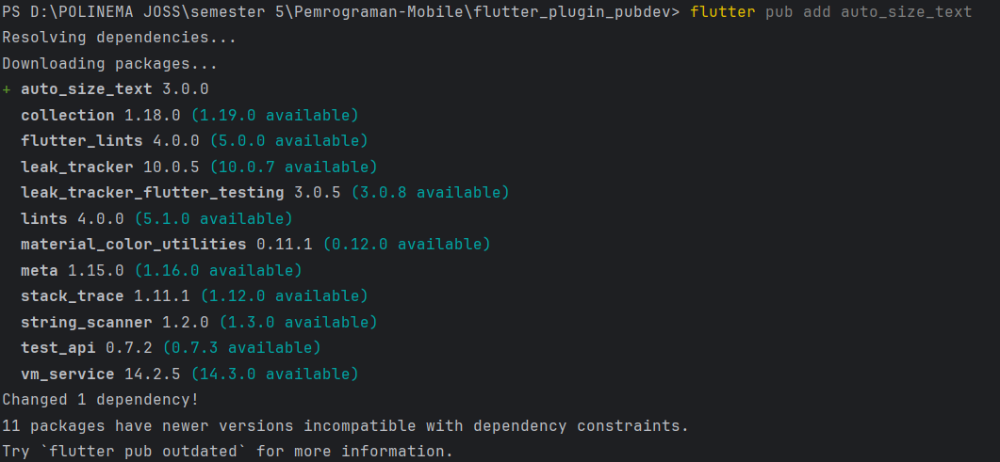
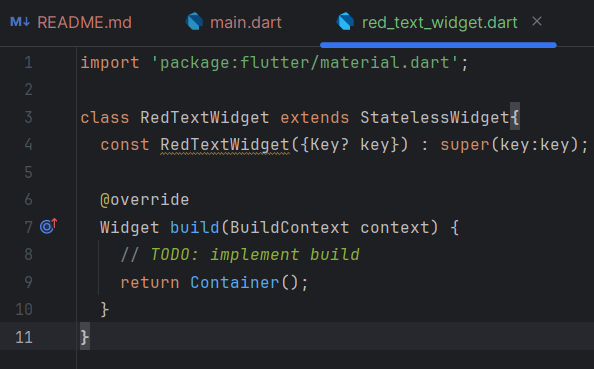
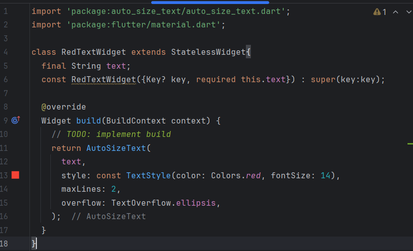
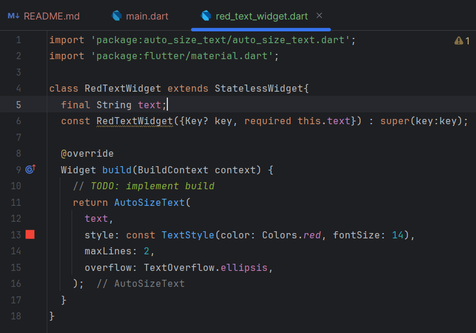
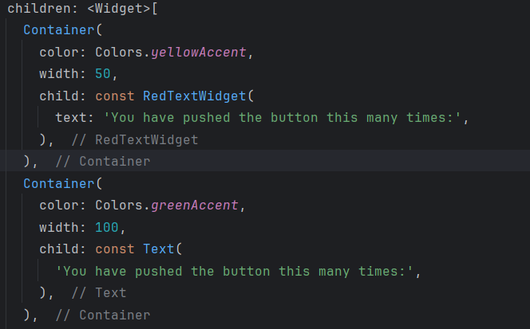
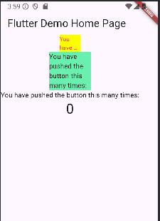

Langkah 2

Langkah 3

Langkah 4

Langkah 5

Langkah 6

Tugas Praktikum

2. Langkah 2 tersebut menjelaskan cara menambahkan plugin auto_size_text ke proyek Flutter melalui terminal. Dengan menjalankan perintah:
   "flutter pub add auto_size_text" Flutter secara otomatis akan menambahkan plugin auto_size_text ke file pubspec.yaml di bagian dependencies. Ini mempermudah proses penambahan dependensi tanpa harus mengedit pubspec.yaml secara manual.
3. Langkah 5 menjelaskan cara membuat variabel text dan menambahkannya sebagai parameter di constructor kelas RedTextWidget. Variabel text didefinisikan sebagai final untuk menunjukkan bahwa nilainya tidak akan berubah setelah diinisialisasi. 
Kemudian, constructor menggunakan parameter required this.text, yang berarti nilai text harus diberikan saat widget RedTextWidget dipanggil.
4. RedTextWidget
- Fungsi: Ini adalah widget kustom yang dirancang untuk menampilkan teks dengan warna merah. Widget ini mengambil parameter text yang menentukan konten yang ditampilkan.
- Perbedaan: Widget ini bersifat dinamis karena dapat menampilkan berbagai teks yang diberikan melalui parameter text. Ini memberikan fleksibilitas dalam penggunaan teks yang dapat berubah sesuai konteks.
Text
- Fungsi: Widget ini adalah widget bawaan Flutter yang digunakan untuk menampilkan teks sederhana.
- Perbedaan: Widget Text digunakan untuk menampilkan teks statis tanpa format atau gaya tambahan. Dalam contoh ini, teks yang ditampilkan tidak memiliki penyesuaian warna atau atribut lainnya yang mungkin ditetapkan di dalam widget kustom RedTextWidget.
5. 
- key:
Deskripsi: Mengontrol bagaimana satu widget menggantikan widget lain dalam pohon widget. Biasanya digunakan untuk identifikasi unik widget di dalam hierarki, membantu dalam pembaruan dan pemeliharaan state widget.
- textKey:
Deskripsi: Menetapkan kunci untuk widget Text yang dihasilkan. Ini berguna jika Anda perlu mengidentifikasi widget Text secara spesifik dalam pohon widget.
- style:
Deskripsi: Jika tidak null, gaya yang akan digunakan untuk teks. Ini bisa mencakup warna, ukuran font, dan atribut gaya lainnya yang diterapkan pada teks.
- minFontSize:
Deskripsi: Batasan ukuran teks minimum yang akan digunakan saat menyesuaikan ukuran teks secara otomatis. Akan diabaikan jika presetFontSizes diatur.
- maxFontSize:
Deskripsi: Batasan ukuran teks maksimum yang akan digunakan saat menyesuaikan ukuran teks secara otomatis. Akan diabaikan jika presetFontSizes diatur.
- stepGranularity:
Deskripsi: Ukuran langkah di mana ukuran font disesuaikan dengan batasan. Menentukan seberapa besar perubahan ukuran font saat menyesuaikan.
- presetFontSizes:
Deskripsi: Menentukan semua ukuran font yang mungkin. Penting untuk dicatat bahwa ukuran font harus dalam urutan menurun.
- group:
Deskripsi: Menyinkronkan ukuran beberapa widget AutoSizeText. Ini memungkinkan beberapa teks untuk menyesuaikan ukuran font secara bersamaan.
- textAlign:
Deskripsi: Menentukan bagaimana teks harus disejajarkan secara horizontal. Nilai-nilai yang mungkin termasuk TextAlign.left, TextAlign.center, TextAlign.right, dll.
- textDirection:
Deskripsi: Arah teks. Ini menentukan bagaimana nilai textAlign seperti TextAlign.start dan TextAlign.end diinterpretasikan, tergantung pada apakah teks diatur dari kiri ke kanan atau kanan ke kiri.
- locale:
Deskripsi: Digunakan untuk memilih font ketika karakter Unicode yang sama dapat dirender secara berbeda, tergantung pada locale (wilayah). Ini memastikan bahwa teks ditampilkan dengan cara yang sesuai dengan bahasa atau wilayah yang ditentukan.
- softWrap:
Deskripsi: Menentukan apakah teks harus terputus pada baris yang lembut (soft line breaks). Ini memungkinkan teks untuk melanjutkan ke baris baru jika tidak muat di baris saat ini.
- wrapWords:
Deskripsi: Menentukan apakah kata-kata yang tidak muat dalam satu baris harus dibungkus. Secara default, ini bernilai true, sehingga berperilaku seperti widget Text.
- overflow:
Deskripsi: Menentukan bagaimana penanganan overflow visual jika teks tidak muat dalam ruang yang diberikan. Ini bisa berupa nilai seperti TextOverflow.ellipsis untuk menampilkan titik-titik di akhir.
- overflowReplacement:
Deskripsi: Jika teks meluap dan tidak muat dalam batasan, widget ini akan ditampilkan sebagai pengganti.
- textScaleFactor:
Deskripsi: Jumlah pixel font untuk setiap pixel logis. Juga mempengaruhi minFontSize, maxFontSize, dan presetFontSizes. Ini memungkinkan penyesuaian ukuran font berdasarkan skala teks.
- maxLines:
Deskripsi: Jumlah maksimum baris yang dapat diisi oleh teks. Ini membatasi berapa banyak baris yang akan ditampilkan sebelum teks terputus.
- semanticsLabel:
Deskripsi: Label semantik alternatif untuk teks ini. Ini berguna untuk aksesibilitas, memberikan deskripsi yang lebih baik tentang konten teks bagi pembaca layar.